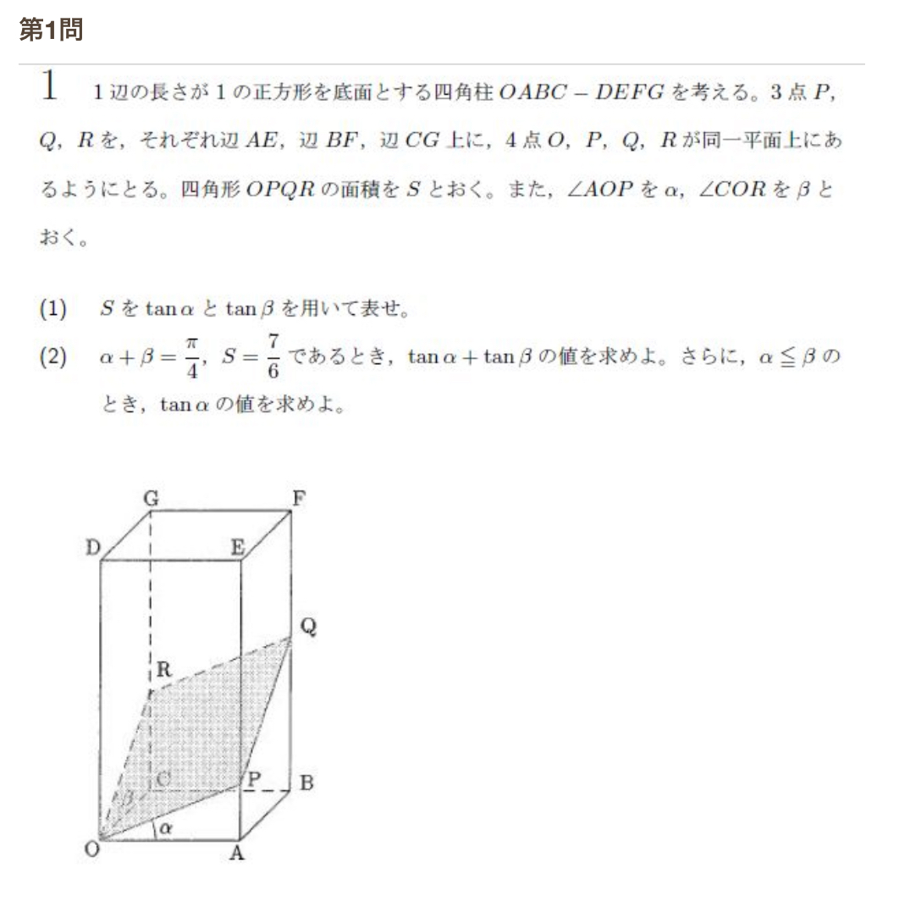
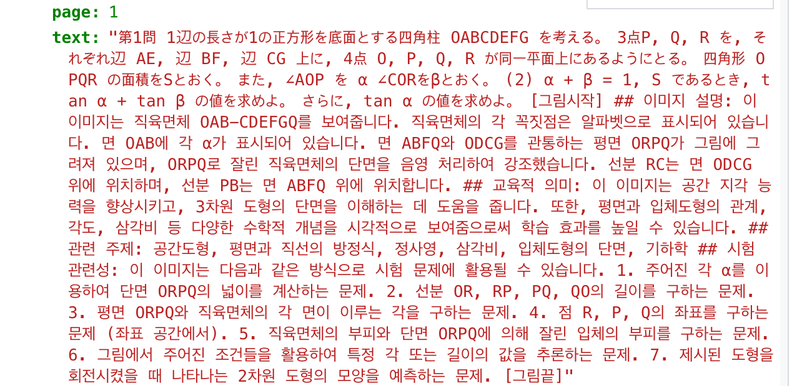
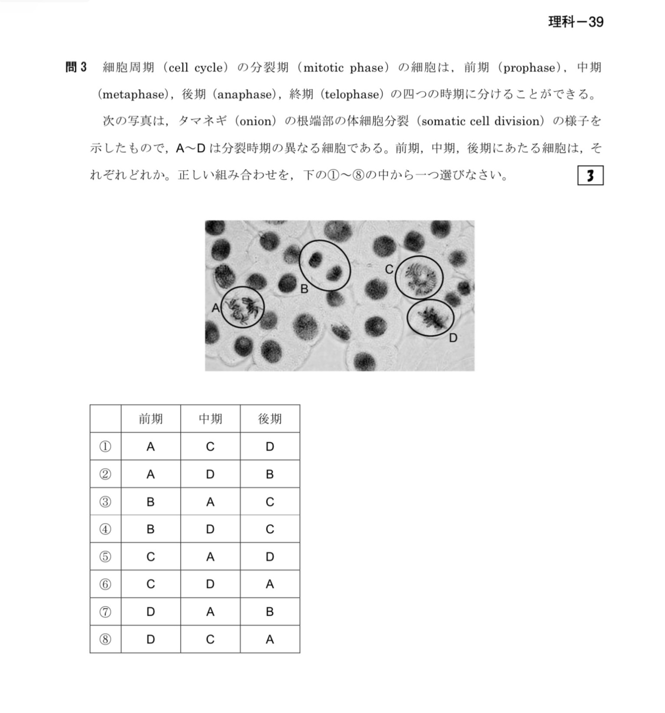
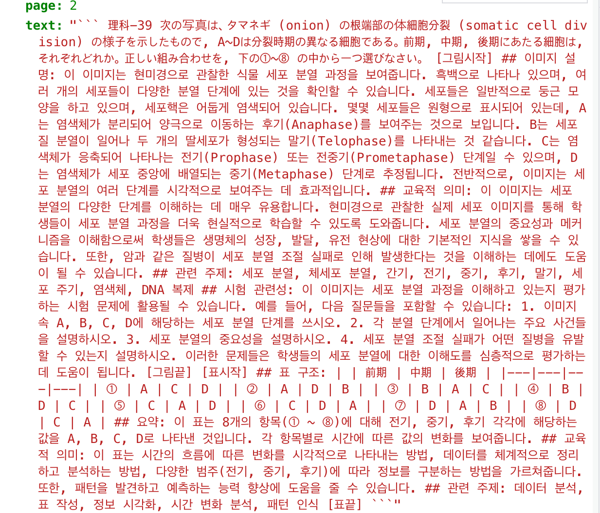

# OCR System for Complex Exam Materials: Biology & Math

## Overview

This custom OCR pipeline is capable of handling multilingual scientific materials, including text, tables, figures, charts, and math formulas. The system is designed for high accuracy processing of complex educational content such as entrance exam materials.
– Key Features**Multilingual Support**: Japanese, Korean, English (customizable)
– **ML Training Optimization**: Adds semantic summaries and educational context to each image/table
    – **High Accuracy**: Over 90~95% accuracy on real-world datasets like EJU Biology and University of Tokyo Math
– **Comprehensive Processing**: Handles complex layouts including text, tables, figures, charts, and mathematical formulas
– Tools Used 
- DocLayout-YOLO
– Google Vision API
– Gemini Pro Vision
– MathPix OCR
– OpenAI API
– OpenCV

## Sample Outputs

Below are real sample outputs from the system processing 2017 EJU Biology & 2014 Tokyo Math exam materials.
**Math Input**

**Output**

text: "Question 1. Consider the rectangular prism OABC–DEFG with a square base of side length 1. Points P, Q, R are on the segments AE, BF, and CG, respectively, and four points O, P, Q, and R lie on the same plane. Let S be the area of quadrilateral OPQR. Also, let ∠AOP be α and ∠COR be β. (2) If α + β = 1 and S = S, find the value of tan α + tan β. Also, if α ≤ β, find the value of tan α. 

[Image Start] 
## Image description:
This image shows the rectangular prism OAB–CDEFGQ. Each vertex is labeled with alphabets. The angle α is marked on face OAB. The plane ORPQ intersects the prism and is highlighted. Line RC lies on face ODCG, and line PB lies on face ABFQ. 

## Educational value:
This image enhances spatial reasoning by visualizing 3D geometry and cross-sections. It helps learners understand concepts such as plane geometry, solid shapes, spatial visualization, and angles. 

## Related topics:
Solid geometry, cross-sections, prism faces, triangle, spatial reasoning

## Exam relevance:
This type of question appears in entrance exams like:
1. Calculate the area of ORPQ using angle α
2. Find the lengths of OR, RP, PQ, QO
3. Determine the angle between ORPQ and the prism's face
4. Locate points P, Q, R in coordinate space
5. Calculate volume/area of the prism parts
6. Predict shapes based on constraints
7. Sketch the shape of the prism

[Image End]"
**Biology Input**

**Output**

text: "Question 39. The photo shows the mitotic cell division process (somatic cell division) of an onion root tip. Cells A–D are in different stages of division. Match the stages (prophase, metaphase, anaphase, telophase) to each cell and select the correct combination from options ①–⑧.

[Image Start]
## Image description:
This image shows the process of plant cell division observed under a microscope. Various cells are in different mitotic phases, including chromosomes aligned at the center (metaphase), separating to poles (anaphase), or forming daughter nuclei (telophase). 

A – appears to be in anaphase  
B – possibly telophase  
C – prophase or prometaphase  
D – metaphase

## Educational value:
This helps students visually understand the process of mitosis, reinforcing knowledge of cell division phases and their characteristics. It connects to biology concepts like DNA replication, cancer biology, and genetics.

## Related topics:
Mitosis, Cell cycle, Prophase, Metaphase, Anaphase, Telophase, DNA replication

## Exam relevance:
This image is used in questions such as:
1. Match A, B, C, D to appropriate mitotic phases
2. Describe characteristics of each phase
3. Explain the significance of mitosis
4. Discuss how errors in mitosis lead to genetic diseases

[Table Start]
| 前期 | 中期 | 後期 |
|------|------|------|
| A    | C    | D    |
| A    | D    | B    |
| B    | C    | C    |
| B    | D    | C    |
| C    | A    | D    |
| C    | D    | A    |
| D    | A    | B    |
| D    | C    | A    |
[Table End]

## Summary:
Each option (①–⑧) corresponds to a specific mapping of A, B, C, D to prophase, metaphase, and anaphase.

## Educational value:
Understanding time-based transition in mitosis and data organization in tables. Enhances data interpretation, pattern recognition, and analysis skills.

## Related topics:
Data analysis, table interpretation, biological data classification

[Image End]"

## Technical Implementation

– Table Processing OptimizationTable regions are detected using DocLayout-YOLO
– Google Vision OCR is used for table processing instead of MathPix for better accuracy with Japanese text
– Table structures are preserved in structured JSON format (maintaining row/column structure)
– Y-coordinate information is maintained to ensure contextual continuity
– Original layout information is preserved alongside structured data for ML training
– Image and Special Region ProcessingImage regions are processed using Google Vision API's image analysis features (imageProperties, labelDetection, textDetection)
– Image descriptions are generated using Google Cloud Vision API
– Graphs/charts are processed using Google Cloud Vision API's document analysis features with data point extraction
– Special region processing results are stored in structured JSON format for ML training
– Original coordinate information and region type metadata are added to maintain contextual continuity

## Purpose and Contact

This OCR system is available for sale or customization purposes. The system can be tailored to specific educational materials, languages, or subject domains based on client requirements.

For inquiries, customization requests, or purchase information, please contact:

**Email**: [ses425500000@gmail.com](mailto:ses425500000@gmail.com)
⸻
_Note: The English translations in the examples were manually reformatted for clarity and consistency. Please treat them as reference only, as structure and layout may differ slightly from the original._
_Keywords: OCR, exam OCR, table recognition, diagram OCR, AI education tools, OpenAI, Gemini Pro Vision, multilingual OCR, DocLayout-YOLO, Machine Learning, educational ML dataset, research OCR, paper OCR, document AI